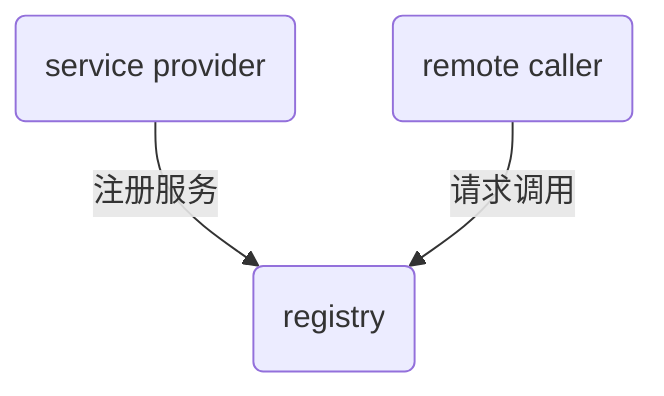
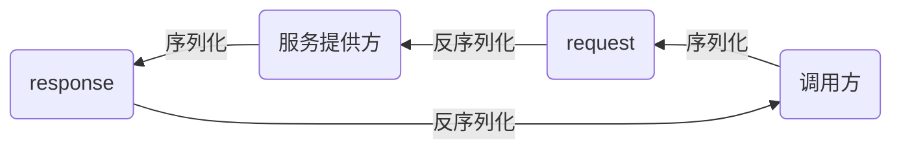
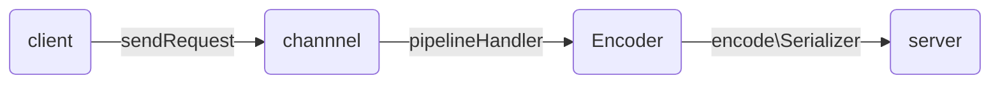
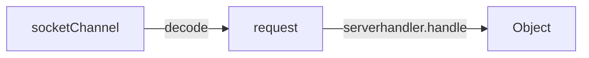

RPC-Netty project

使用netty作为主要的IO框架，实现基于zookeeper、netty、jackson、序列化框架实现的RPC demo.
架构设计:

## 1、服务注册和服务信息获取



### 1.服务数据结构

通过zookeeper存放服务信息和多个server信息（二进制或者json串），服务提供格式如下：

```java
@Data
public class RpcProtocol implements Serializable {
    public static final long serialVersionUID = -1102180003395190700L;
    private String host;			//server host
    private int port;				//server host
    private List<RpcServiceInfo> serviceInfos;	//service infos
}
```

而`RpcServiceInfo`实现主要的`service class`信息和`method`信息：

```java
@Data
public class RpcServiceInfo implements Serializable {
    private String serviceName;
    private String version;
}
```

### 2.服务信息json和反json

并且使用json串实现注册中心的注册行为和获取服务信息的方法：

```java
	/**
     *
     * @return: json String for serialize
     */
    public String toJson(){
        String json = JsonUtil.objectToJson(this);
        RpcProtocol obj = JsonUtil.jsonToObject (json, RpcProtocol.class);
        return json;
    }
    /**
     * json string to RpcProtocol
     * @param json
     * @return RpcProtocol instance
     */
    public static RpcProtocol fromJson(String json){
        return JsonUtil.jsonToObject(json, RpcProtocol.class);
    }
```

同时jsonUtil实现如下：

```java
import com.fasterxml.jackson.annotation.JsonInclude;
import com.fasterxml.jackson.core.JsonGenerator;
import com.fasterxml.jackson.core.JsonParser;
import com.fasterxml.jackson.core.JsonProcessingException;
import com.fasterxml.jackson.databind.*;
public class JsonUtil {
    public static ObjectMapper  objectMapper= new ObjectMapper();
    static {
        //configure ObjectMapper
        SimpleDateFormat dateFormat = new SimpleDateFormat("yyyy-MM-dd HH:mm:ss");
        objectMapper.setDateFormat(dateFormat);
        objectMapper.setSerializationInclusion(JsonInclude.Include.NON_NULL);
        objectMapper.enable(SerializationFeature.INDENT_OUTPUT);
        objectMapper.configure(JsonGenerator.Feature.AUTO_CLOSE_TARGET, false);
        objectMapper.configure(JsonGenerator.Feature.AUTO_CLOSE_JSON_CONTENT, false);
        //objectMapper.configure(JsonGenerator.Feature.AUTO_CLOSE_TARGET, false);
        objectMapper.disable(SerializationFeature.FLUSH_AFTER_WRITE_VALUE);
        objectMapper.disable(SerializationFeature.FAIL_ON_EMPTY_BEANS);
        objectMapper.disable(DeserializationFeature.FAIL_ON_UNKNOWN_PROPERTIES);
        objectMapper.configure(JsonParser.Feature.IGNORE_UNDEFINED,true);
        objectMapper.disable(SerializationFeature.CLOSE_CLOSEABLE);
    }
    public static <T> byte[] serialize(T obj){
        byte[] bytes = new byte[0];
        try {
            bytes = objectMapper.writeValueAsBytes(obj);
        }catch (JsonProcessingException e){
            throw new IllegalStateException(e.getMessage(),e);
        }
        return bytes;
    }
    public static <T> T deserialize(byte[] bytes, Class<T> clazz){
        T obj = null;
        try {
            obj = objectMapper.readValue(bytes, clazz);
        }catch (IOException e){
            throw new IllegalStateException(e.getMessage(),e);
        }
        return obj;
    }
    public static <T> T jsonToObject(String json, Class<T> clazz){
        T obj = null;
        JavaType javaType = objectMapper.getTypeFactory().constructType(clazz);
        try {
            obj = objectMapper.readValue(json, javaType);
        } catch (IOException e) {
           throw new IllegalStateException(e.getMessage(), e);
        }
        return obj;
    }

    public static <T> T jsonToObjectList(String json,
                                               Class<?> collectionClass, Class<?>... elementClass) {
        T obj = null;
        JavaType javaType = objectMapper.getTypeFactory().constructParametricType(
                collectionClass, elementClass);
        try {
            obj = objectMapper.readValue(json, javaType);
        } catch (IOException e) {
            throw new IllegalStateException(e.getMessage(), e);
        }
        return obj;
    }
    public static <T> T jsonToObjectHashMap(String json,
                                                  Class<?> keyClass, Class<?> valueClass) {
        T obj = null;
        JavaType javaType = objectMapper.getTypeFactory().constructParametricType(HashMap.class, keyClass, valueClass);
        try {
            obj = objectMapper.readValue(json, javaType);
        } catch (IOException e) {
            throw new IllegalStateException(e.getMessage(), e);
        }
        return obj;
    }
    public static String objectToJson(Object o) {
        String json = "";
        try {
            json = objectMapper.writeValueAsString(o);
        } catch (IOException e) {
            throw new IllegalStateException(e.getMessage(), e);
        }
        return json;
    }
}
```

### 3.服务注册发现

使用jackson实现数据绑定，序列化和反序列化`RpcProtocol`,同样的使用该数据的有服务发现`ServiceDiscorvery`模块，反序列化对象依旧是`RpcProtocol`.

```java
public class ServiceDiscovery {
    public static final Logger logger = LoggerFactory.getLogger(ServiceDiscovery.class);
    //service registry client
    //in this demo i use zookeeper cutatorclient
    //private CuratorClient client;
    private void discoveryService();    //发现服务
    private void getServiceAndUpdateServer();     //实现服务的更新
    private void updateConnectedServer(List<RpcProtocol> protocols);
}
```

同样的服务注册也是基于`RpcProtocol`的序列化和反序列化实现：

```java
public class ServiceRegistry {
    private static final Logger logger = LoggerFactory.getLogger(ServiceRegistry.class);
    // zookeeper client
    //private CuratorClient client;
    // zookeeper path
    private List<String> pathList = new ArrayList<String>();
    public ServiceRegistry(CuratorClient client) {
        this.client = client;
    }
    public void registryService(final String host, final int port, final Map<String, Object> serviceMap);
    public void unregisterService();
}
```

## 2、远程调用客户端实现

远程调用核心是客户端和服务端通过传输的数据流进行序列和反序列化，也就是通过`request`发送远程调用的请求，通过`response`返回调用结果。




### 1.序列化器

序列化器提供序列化和反序列化方法，主要用于发送二进制流的`request`和`response`数据流。

```java
package com.lixiande.common.serializer;
/**
* @program: Serializer
*
* @description: Serializer implement
*
* @author: LiXiande
*
* @create: 16:47 2020/9/30
**/
public abstract class Serializer {
    /**
     * @param obj
     * @param <T>
     * @return obj -> byte[] for socket transport
     */
    public abstract <T> byte[] serialize(T obj);
    /**
     * @param bytes
     * @param clazz
     * @param <T>
     * @return byte[] -> obj for remote call
     */
    public abstract <T> Object deserialize(byte[] bytes, Class<T> clazz);
}
```

可以通过不同的框架如`kryo、protostuff、hessian`等实现不同的序列化方法。

### 2.request

request类主要负责记录远程请求信息和服务器信息，并传输调用的参数类型和参数。

```java
@Data
public class RpcRequest implements Serializable {
    private String requestId;	//ID，方便后续查询错误
    private String className;	//请求类名
    private String methodName;	//请求方法名
    private Class<?>[] parameterTypes;	//参数类型列表
    private Object[] parameters;	//参数类型
    private String version;			//接口版本，对应不同的接口实现
}
```

`request`通过`client`的channelRead0方法发送到channel中，channel通过Encoder.encode序列化成为二进制流形式传输到server端。



### 3.client

那么对应的client实现如下：

```java
public class RpcClient implements ApplicationContextAware, DisposableBean {
    public static final Logger logger = LoggerFactory.getLogger(RpcClient.class);		//logger
    private ServiceDiscovery discovery;													//service discovery
    private static ThreadPoolExecutor threadPoolExecutor = new ThreadPoolExecutor(16,16,600L, TimeUnit.SECONDS, new LinkedBlockingDeque<Runnable>(1000));													//threadpool to send request

    public RpcClient(ServiceDiscovery discovery) ;
    public static <T,P> T createService(Class<T> interfaceClass, String version);		//Service instance in client
    public static <T, P> RpcService createAsyncService(Class<T> interfaceClass, String version);		//Async Service instance in client
    @Override
    public void destroy() throws Exception;
    @Override
    public void setApplicationContext(ApplicationContext applicationContext) throws BeansException ;
    public void stop();
    public static void submit(Runnable task);
}
```

### 4.channelInitializer

对应的channelInitializer实现如下：

```java
public class RpcClientInitializer extends ChannelInitializer<SocketChannel> {		//基于SocketChannel
    @Override
    protected void initChannel(SocketChannel socketChannel) throws Exception {
        Serializer serializer = HessianSerializer.class.newInstance();
        ChannelPipeline pipeline = socketChannel.pipeline();	
        pipeline.addLast(new IdleStateHandler(0, 0, Beat.BEAT_INTERVAL, TimeUnit.SECONDS));		//HeartBeat Request for registy
        pipeline.addLast(new RpcEncoder(RpcRequest.class, serializer));							//encoder for request
        pipeline.addLast(new LengthFieldBasedFrameDecoder(65536, 0,4,0,0));						
        pipeline.addLast(new RpcDecoder(RpcResponse.class, serializer));						//decoder for response
        pipeline.addLast(new RpcClientHandler());												//send requst handler
    }
}
```

### 5.encoder 实现

`encoder`实现如下：

```java
public class RpcEncoder extends MessageToByteEncoder {
    private static final Logger logger = LoggerFactory.getLogger(RpcEncoder.class);
    private Class<?> genericClass;			//对应的类型
    private Serializer serializer;			//对应的序列化器
    public RpcEncoder(Class<?> genericClass, Serializer serializer){
        this.genericClass = genericClass;
        this.serializer = serializer;
    }
    @Override
    protected void encode(ChannelHandlerContext channelHandlerContext, Object o, ByteBuf byteBuf) throws Exception;	//按照类型进行序列化
}
```

### 6.ClientHandler实现

那么整个clientHandler需要做的就是生成Request并且发送到channel中。

```java
@Data
public class RpcClientHandler extends SimpleChannelInboundHandler<RpcResponse> {
    public static final Logger logger = LoggerFactory.getLogger(RpcClientHandler.class);
    private volatile Channel channel;
    private SocketAddress remotePeer;
    private RpcProtocol rpcProtocol;

    private ConcurrentHashMap<String, RpcFuture> pendingRpc = new ConcurrentHashMap<>();	//未完成的队列
    public void close(){
        channel.writeAndFlush(Unpooled.EMPTY_BUFFER).addListener(ChannelFutureListener.CLOSE);
    }
    /**
     * send request and get invoke result
     * @param request : request to send
     * @return
     */
    public RpcFuture sendRequest(RpcRequest 
    /**
     * deal channel read context
     * @param channelHandlerContext : channel context
     * @param rpcResponse : for client, all need is to deal with response
     * @throws Exception
     */
    @Override
    protected void channelRead0(ChannelHandlerContext channelHandlerContext, RpcResponse rpcResponse) throws Exception;	//接受response并从pendingRequest中移除。

    @Override
    public void channelInactive(ChannelHandlerContext ctx) throws Exception;


    @Override
    public void userEventTriggered(ChannelHandlerContext ctx, Object evt) throws Exception ; 

    @Override
    public void channelActive(ChannelHandlerContext ctx) throws Exception 

    @Override
    public void channelRegistered(ChannelHandlerContext ctx) throws Exception ;
```

## 3、远程调用服务器端实现

对于远程调用服务器端，需要通过`decode request`实现调用类、方法、参数、参数类型的获取，完成调用并将调用结果返回。具体调用过程如下：




### 1.Decoder

```java
public class RpcDecoder extends ByteToMessageDecoder {
    private static final Logger logger = LoggerFactory.getLogger(RpcDecoder.class);
    private Class<?> genericClass;			//decode返回的类型
    private Serializer serializer;			//反序列化工具
    public RpcDecoder(Class<?> genericClass, Serializer serializer) {
        this.genericClass = genericClass;
        this.serializer = serializer;
    }
    @Override
    protected void decode(ChannelHandlerContext channelHandlerContext, ByteBuf byteBuf, List<Object> list) throws Exception ;
    }
```

### 2.ServerHandler

主要进行反序列化和记录服务信息，并使用handle方法完成调用。

```java
public class RpcServerHandler extends SimpleChannelInboundHandler<RpcRequest> {
    public static final Logger logger = LoggerFactory.getLogger(RpcServerHandler.class);
    // serviceKey to Object
    private final Map<String, Object> handlerMap;
    // server handler pool
    private final ThreadPoolExecutor serverHandlerPool;

    public RpcServerHandler(Map<String, Object> handlerMap, ThreadPoolExecutor serverHandlerPool){
        this.handlerMap = handlerMap;
        this.serverHandlerPool = serverHandlerPool;
    }
    /**
     * solve request and do remote call
     * @param channelHandlerContext : channel context
     * @param rpcRequest : request contains remote call infos
     * @throws Exception
     */
    @Override
    protected void channelRead0(final ChannelHandlerContext channelHandlerContext, final RpcRequest rpcRequest) throws Exception ;	//will call handle function and get result? not now, maybe add future
    // do handle request and put serviceKey - object into handlerMap
    public Object handle(RpcRequest request) throws InvocationTargetException ;
    @Override
    public void exceptionCaught(ChannelHandlerContext ctx, Throwable cause) throws Exception ;
    @Override
    public void userEventTriggered(ChannelHandlerContext ctx, Object evt) throws Exception ;
}
```

### 3.对应的serverChannelInitializer

将对应的处理器放置到channel中

```java
public class RpcServerInitializer extends ChannelInitializer<SocketChannel> {
    private Map<String , Object> handlerMap;	//serviceKey - handle result
    private ThreadPoolExecutor threadPoolExecutor;	//init serverHandler with special threadPool
    public RpcServerInitializer(Map<String, Object> handlerMap, ThreadPoolExecutor threadPoolExecutor) {
        this.handlerMap = handlerMap;
        this.threadPoolExecutor = threadPoolExecutor;
    }
    @Override
    protected void initChannel(SocketChannel socketChannel) throws Exception {
        /**
         * for server
         * decode request
         * encode response
         */
        Serializer serializer = HessianSerializer.class.newInstance();	//sepecial Serializer
        ChannelPipeline pipeline = socketChannel.pipeline();
        pipeline.addLast(new IdleStateHandler(0,0, Beat.BEAT_TIMEOUT, TimeUnit.SECONDS));	// heart beat
        pipeline.addLast(new LengthFieldBasedFrameDecoder(65536, 0,4,0,0));
        pipeline.addLast(new RpcDecoder(RpcRequest.class, serializer));	//decode request
        pipeline.addLast(new RpcEncoder(RpcResponse.class, serializer));	//encode response
        pipeline.addLast(new RpcServerHandler(handlerMap, threadPoolExecutor));	//handle request
    }
}
```

## 4、测试结果

//TODO: 测试