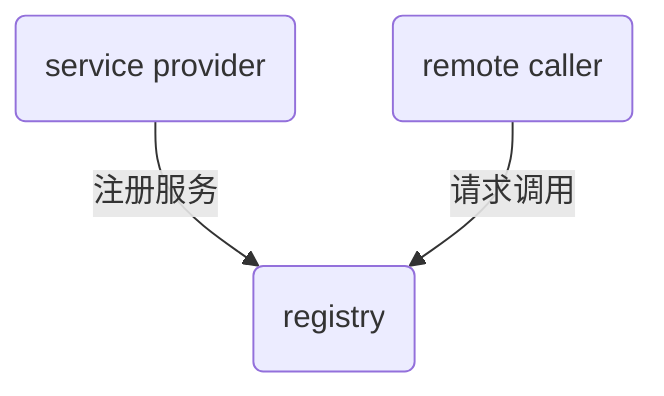

RPC-Netty project

使用netty作为主要的IO框架，实现基于zookeeper、netty、jackson、序列化框架实现的RPC demo.
架构设计:

## 1、服务注册和服务信息获取



### 1.服务数据结构

通过zookeeper存放服务信息和多个server信息（二进制或者json串），服务提供格式如下：

```java
@Data
public class RpcProtocol implements Serializable {
    public static final long serialVersionUID = -1102180003395190700L;
    private String host;			//server host
    private int port;				//server host
    private List<RpcServiceInfo> serviceInfos;	//service infos
}
```

而`RpcServiceInfo`实现主要的`service class`信息和`method`信息：

```java
@Data
public class RpcServiceInfo implements Serializable {
    private String serviceName;
    private String version;
}
```

### 2.服务信息json和反json

并且使用json串实现注册中心的注册行为和获取服务信息的方法：

```java
	/**
     *
     * @return: json String for serialize
     */
    public String toJson(){
        String json = JsonUtil.objectToJson(this);
        RpcProtocol obj = JsonUtil.jsonToObject (json, RpcProtocol.class);
        return json;
    }
    /**
     * json string to RpcProtocol
     * @param json
     * @return RpcProtocol instance
     */
    public static RpcProtocol fromJson(String json){
        return JsonUtil.jsonToObject(json, RpcProtocol.class);
    }
```

同时jsonUtil实现如下：

```java
import com.fasterxml.jackson.annotation.JsonInclude;
import com.fasterxml.jackson.core.JsonGenerator;
import com.fasterxml.jackson.core.JsonParser;
import com.fasterxml.jackson.core.JsonProcessingException;
import com.fasterxml.jackson.databind.*;
public class JsonUtil {
    public static ObjectMapper  objectMapper= new ObjectMapper();
    static {
        //configure ObjectMapper
        SimpleDateFormat dateFormat = new SimpleDateFormat("yyyy-MM-dd HH:mm:ss");
        objectMapper.setDateFormat(dateFormat);
        objectMapper.setSerializationInclusion(JsonInclude.Include.NON_NULL);
        objectMapper.enable(SerializationFeature.INDENT_OUTPUT);
        objectMapper.configure(JsonGenerator.Feature.AUTO_CLOSE_TARGET, false);
        objectMapper.configure(JsonGenerator.Feature.AUTO_CLOSE_JSON_CONTENT, false);
        //objectMapper.configure(JsonGenerator.Feature.AUTO_CLOSE_TARGET, false);
        objectMapper.disable(SerializationFeature.FLUSH_AFTER_WRITE_VALUE);
        objectMapper.disable(SerializationFeature.FAIL_ON_EMPTY_BEANS);
        objectMapper.disable(DeserializationFeature.FAIL_ON_UNKNOWN_PROPERTIES);
        objectMapper.configure(JsonParser.Feature.IGNORE_UNDEFINED,true);
        objectMapper.disable(SerializationFeature.CLOSE_CLOSEABLE);
    }
    public static <T> byte[] serialize(T obj){
        byte[] bytes = new byte[0];
        try {
            bytes = objectMapper.writeValueAsBytes(obj);
        }catch (JsonProcessingException e){
            throw new IllegalStateException(e.getMessage(),e);
        }
        return bytes;
    }
    public static <T> T deserialize(byte[] bytes, Class<T> clazz){
        T obj = null;
        try {
            obj = objectMapper.readValue(bytes, clazz);
        }catch (IOException e){
            throw new IllegalStateException(e.getMessage(),e);
        }
        return obj;
    }
    public static <T> T jsonToObject(String json, Class<T> clazz){
        T obj = null;
        JavaType javaType = objectMapper.getTypeFactory().constructType(clazz);
        try {
            obj = objectMapper.readValue(json, javaType);
        } catch (IOException e) {
           throw new IllegalStateException(e.getMessage(), e);
        }
        return obj;
    }

    public static <T> T jsonToObjectList(String json,
                                               Class<?> collectionClass, Class<?>... elementClass) {
        T obj = null;
        JavaType javaType = objectMapper.getTypeFactory().constructParametricType(
                collectionClass, elementClass);
        try {
            obj = objectMapper.readValue(json, javaType);
        } catch (IOException e) {
            throw new IllegalStateException(e.getMessage(), e);
        }
        return obj;
    }
    public static <T> T jsonToObjectHashMap(String json,
                                                  Class<?> keyClass, Class<?> valueClass) {
        T obj = null;
        JavaType javaType = objectMapper.getTypeFactory().constructParametricType(HashMap.class, keyClass, valueClass);
        try {
            obj = objectMapper.readValue(json, javaType);
        } catch (IOException e) {
            throw new IllegalStateException(e.getMessage(), e);
        }
        return obj;
    }
    public static String objectToJson(Object o) {
        String json = "";
        try {
            json = objectMapper.writeValueAsString(o);
        } catch (IOException e) {
            throw new IllegalStateException(e.getMessage(), e);
        }
        return json;
    }
}
```

### 3.服务注册发现

使用jackson实现数据绑定，序列化和反序列化`RpcProtocol`,同样的使用该数据的有服务发现`ServiceDiscorvery`模块，反序列化对象依旧是`RpcProtocol`.

```java
public class ServiceDiscovery {
    public static final Logger logger = LoggerFactory.getLogger(ServiceDiscovery.class);
    //service registry client
    //in this demo i use zookeeper cutatorclient
    //private CuratorClient client;
    private void discoveryService();    //发现服务
    private void getServiceAndUpdateServer();     //实现服务的更新
    private void updateConnectedServer(List<RpcProtocol> protocols);
}
```

同样的服务注册也是基于`RpcProtocol`的序列化和反序列化实现：

```java
public class ServiceRegistry {
    private static final Logger logger = LoggerFactory.getLogger(ServiceRegistry.class);
    // zookeeper client
    //private CuratorClient client;
    // zookeeper path
    private List<String> pathList = new ArrayList<String>();
    public ServiceRegistry(CuratorClient client) {
        this.client = client;
    }
    public void registryService(final String host, final int port, final Map<String, Object> serviceMap);
    public void unregisterService();
}
```

## 2、远程调用实现

//TODO: 完成远程的实现编写